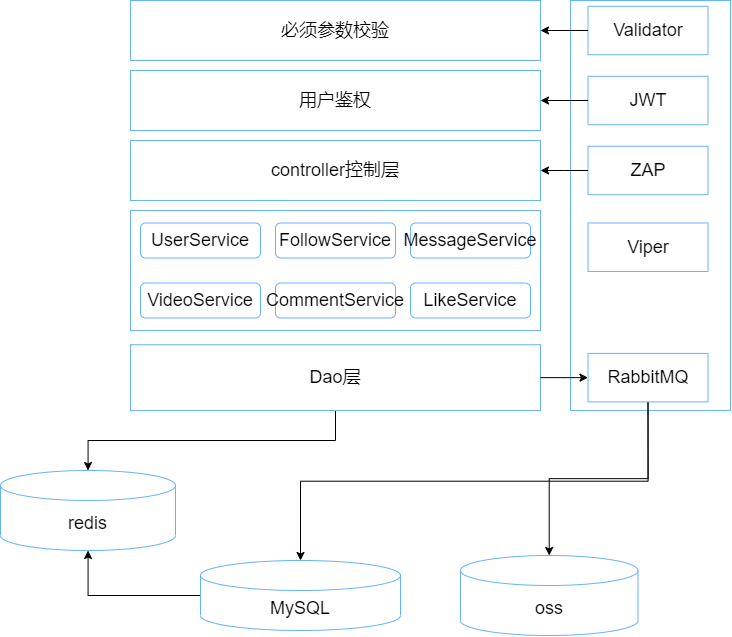
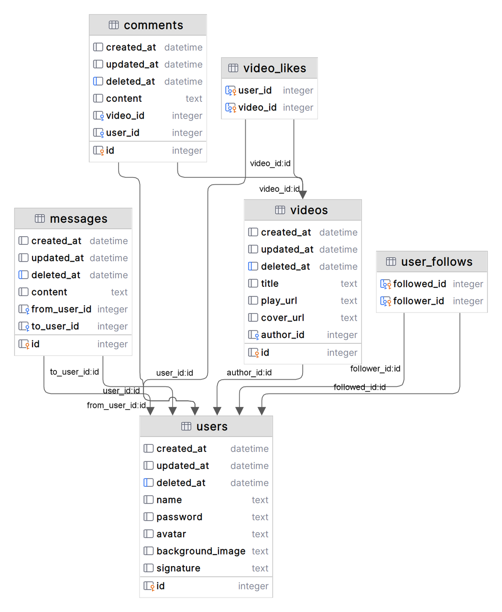
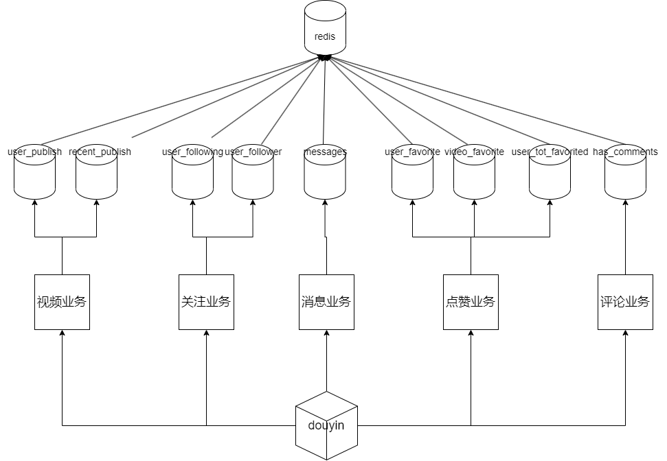
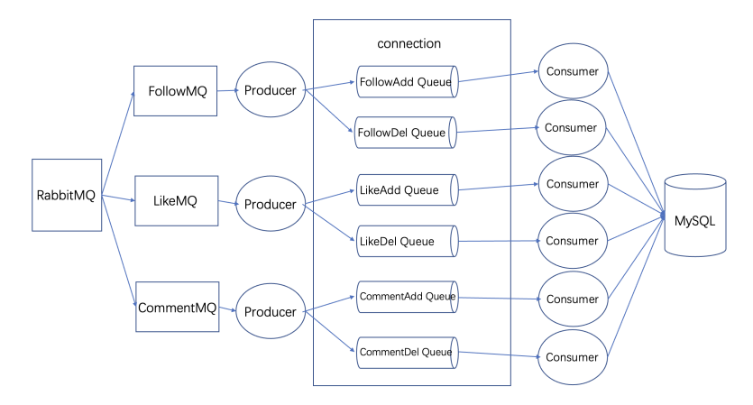

# youthcamp-star
the 6th ByteDance YouthCamp star team

**基于go-fiber框架的极简抖音后端**
## 项目介绍
- 队伍名称: star :sparkles:
- 汇报文档: [汇报文档](https://b06sbsne68.feishu.cn/docx/ZS4edbf9doNHpGxhiyYc0lEOnLb)
- 接口文档: [apifox](https://apifox.com/apidoc/shared-9beddbd8-97a5-4a98-a9b2-4b17a320d957)

## 项目运行
### 1. 依赖

- go 1.20
- mysql, redis, rabbitmq

### 2. 运行
```shell
git clone https://github.com/youthcamp-star/douyin.git
```
复制`config_example.json`为`config.json`，并修改配置文件

确定redis、mysql、rabbitmq服务已启动

运行：
```shell
go run main.go
```


## 项目结构
### 目录结构
```go
├── README.md
├── bootstrap
│   └── init.go
├── config
│   ├── config.go
│   ├── config.json
│   ├── config_example.json
│   ├── database.go
│   └── redis.go
├── controller
│   ├── comment.go
│   ├── common.go
│   ├── demo_data.go
│   ├── favorite.go
│   ├── feed.go
│   ├── message.go
│   ├── publish.go
│   ├── relation.go
│   ├── routes.go
│   └── user.go
├── docs
│   ├── assets
│   │   ├── b4df79ccbd27c0fc7c4c8f9015e2a18.png
│   │   └── img.png
│   └── git规范.md
├── go.mod
├── go.sum
├── main.go
├── middleware
│   ├── middleware.go
│   └── rabbitmq
│       ├── commentMQ.go
│       ├── followMQ.go
│       ├── likeMQ.go
│       └── rabbitMQ.go
├── models
│   ├── comment.go
│   ├── favorite.go
│   ├── init.go
│   ├── message.go
│   ├── relation.go
│   ├── response.go
│   ├── user.go
│   └── video.go
├── public
│   ├── bear.mp4
│   ├── common.go
│   └── data
├── service
│   ├── CommentService.go
│   ├── FavoriteService.go
│   ├── MessageService.go
│   ├── RelationService.go
│   ├── UserService.go
│   ├── VideoService.go
│   ├── ossService.go
│   └── redisService.go
├── templates
│   └── index.html
├── test
│   ├── base_api_test.go
│   ├── common.go
│   ├── interact_api_test.go
│   └── social_api_test.go
└── utils
├── errno
│   ├── code.go
│   ├── errconst
│   │   ├── apiserver.go
│   │   └── base.go
│   ├── errno.go
│   ├── runfile
│   │   └── run.go
│   ├── 使用说明.md
│   ├── 声明规则.md
│   └── 错误列表.md
├── jwt
│   ├── init.go
│   └── jwt.go
├── log
│   └── log.go
└── validator
├── init.go
├── required_if.go
└── validator.go
```
### 服务架构
 
#### mysql

#### redis

#### rabbitmq

